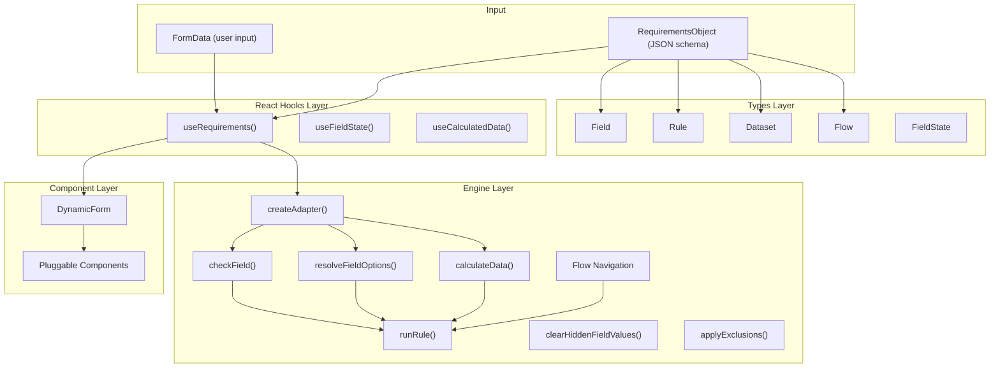
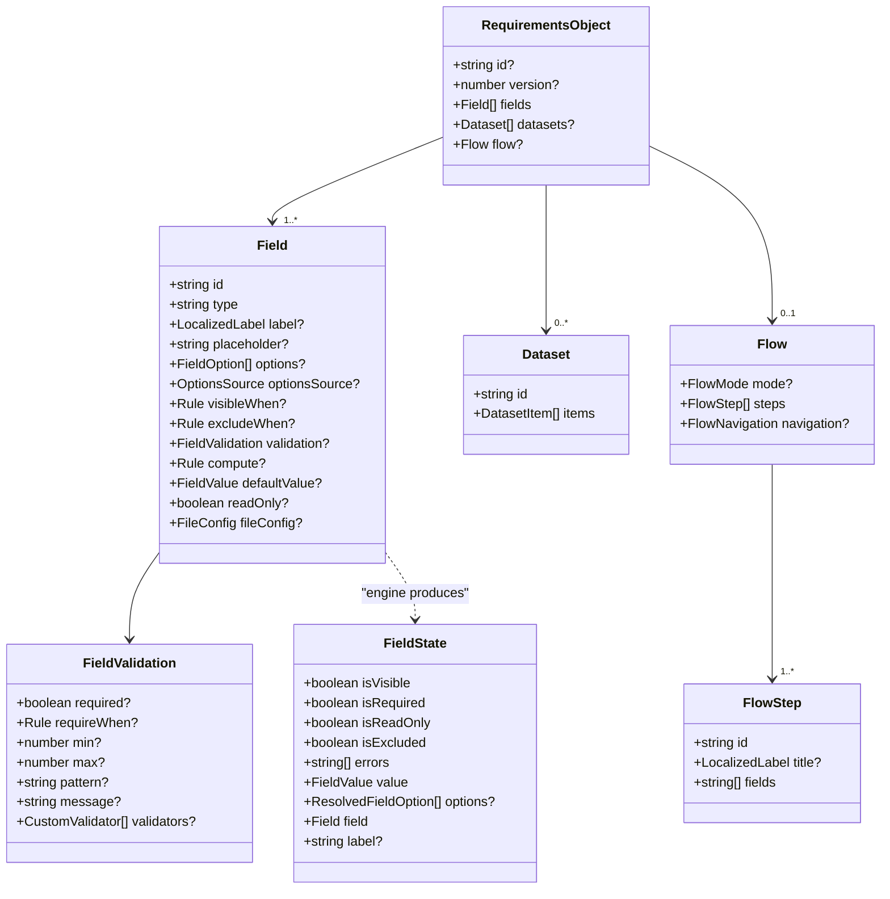
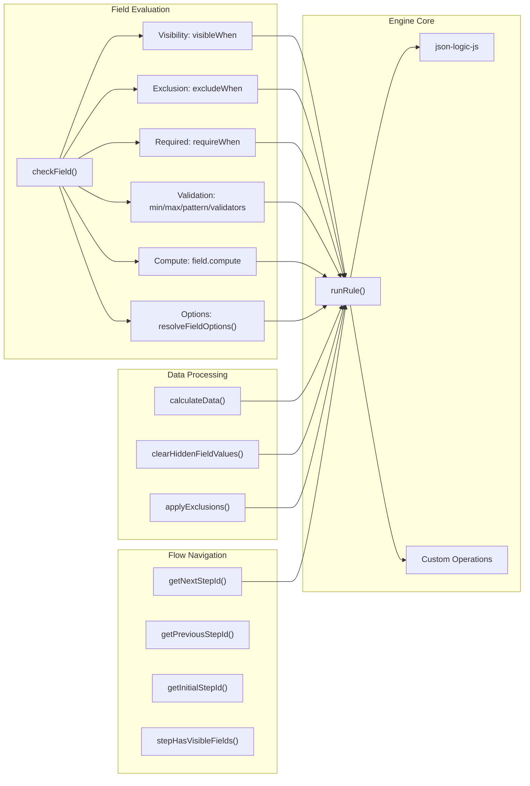
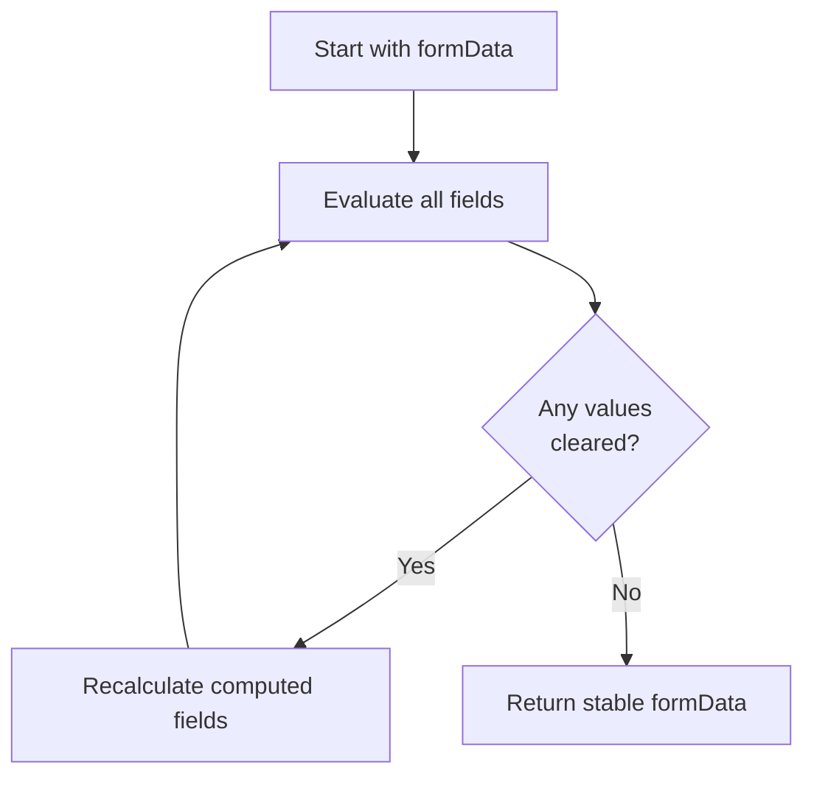
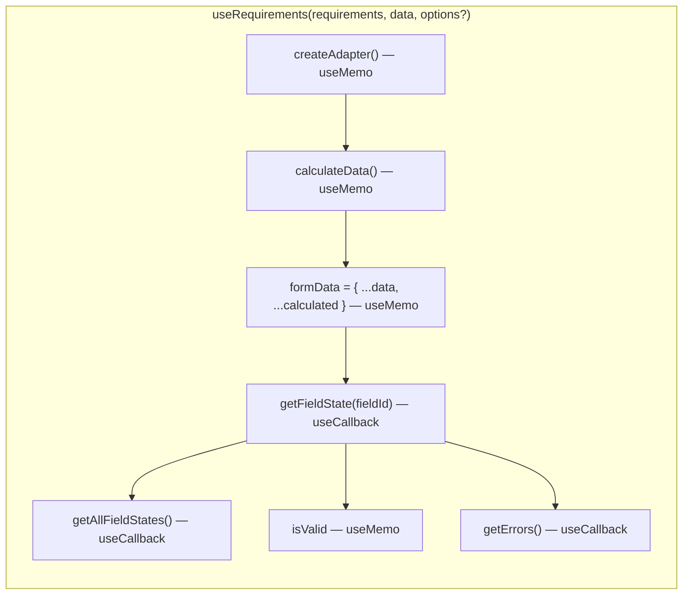
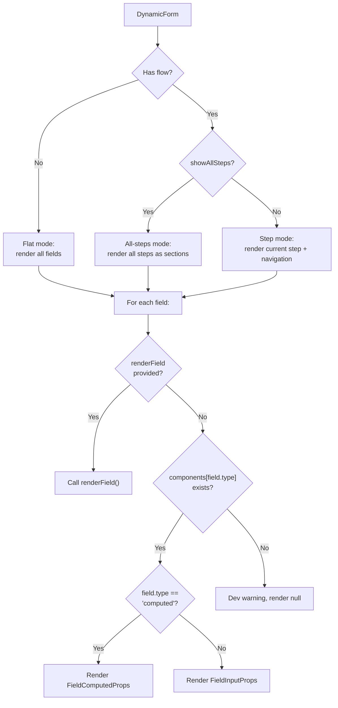
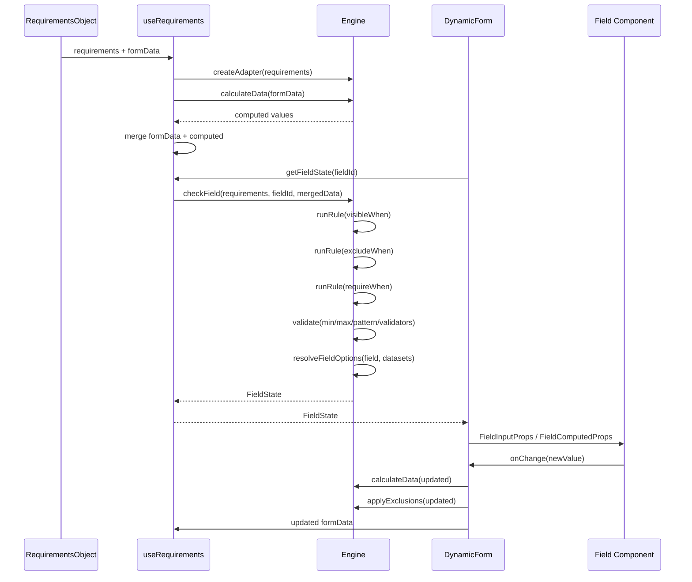

# Architecture

## Overview

`@kota/dynamic-form` is a schema-driven form system that renders forms from a declarative JSON configuration (`RequirementsObject`). A JSON Logic rule engine evaluates conditional visibility, dynamic validation, computed fields, and dataset filtering at runtime.

The package has four layers: **Types**, **Engine**, **React Hooks**, and **Component**, organized into `core/` (internal) and `react/` (public API) directories with multiple entry points.



## Layer Details

### 1. Types Layer (`core/types.ts`)

Defines the schema shape and runtime state types using plain TypeScript interfaces and type aliases.



**Key types:**

| Type                 | Purpose                                                  |
| -------------------- | -------------------------------------------------------- |
| `RequirementsObject` | Top-level schema: fields, datasets, optional flow        |
| `Field`              | Single field definition with rules and validation        |
| `Rule`               | JSON Logic expression (recursive union type)             |
| `Dataset`            | Named collection of option items for selects/radios      |
| `Flow`               | Multi-step form configuration with navigation rules      |
| `FieldState`         | Runtime state produced by the engine for a field         |
| `FormData`           | `Record<string, FieldValue>` — the form's current values |

### 2. Engine Layer (`core/engine.ts`)

The engine is a pure-function evaluation layer. It takes a `RequirementsObject` + `FormData` and produces `FieldState` objects. It has no React dependency and can run server-side or in tests.



#### Engine Functions

| Function                                                             | Purpose                                                               |
| -------------------------------------------------------------------- | --------------------------------------------------------------------- |
| `runRule(rule, context)`                                             | Evaluates a JSON Logic expression against a data context              |
| `checkField(requirements, fieldId, data, options?)`                  | Computes the full `FieldState` for one field                          |
| `calculateData(requirements, data)`                                  | Returns computed field values only                                    |
| `resolveFieldOptions(field, datasets?, context?, labelResolver?)`    | Resolves static options or dataset items, applies filters             |
| `clearHiddenFieldValues(requirements, data)`                         | Iterates until stable, clearing values where `visibleWhen` is false   |
| `applyExclusions(requirements, data)`                                | Iterates until stable, clearing values where `excludeWhen` is true    |
| `createAdapter(requirements, mapping?, options?)`                    | Factory bundling engine functions with optional field ID remapping    |
| `getNextStepId(flow, currentStepId, data, options?)`                 | Resolves next step (rules first, then sequential), skips empty steps  |
| `getPreviousStepId(flow, currentStepId)`                             | Returns previous step (sequential only)                               |
| `getInitialStepId(flow, options?)`                                   | Returns start step, skipping empty steps                              |
| `stepHasVisibleFields(requirements, stepId, data, options?)`         | Checks if a step has at least one visible field                       |
| `resolveLabel(label, locale?)`                                       | Default label resolver (string passthrough, `{ default }` extraction) |
| `runCustomValidators(value, validators, context, customValidators?)` | Runs built-in + custom validators, supports conditional `when` param  |

#### JSON Logic Rule Engine

Rules are evaluated by `json-logic-js` with custom operations registered on first use:

| Operation       | Description                                       |
| --------------- | ------------------------------------------------- |
| `today`         | Returns current date as `YYYY-MM-DD`              |
| `age_from_date` | Calculates age in years from a date               |
| `months_since`  | Months elapsed since a date                       |
| `date_diff`     | Difference between two dates in days/months/years |
| `abs`           | Absolute value                                    |

Standard JSON Logic operations (`==`, `!=`, `>`, `<`, `and`, `or`, `if`, `+`, `-`, `*`, `/`, `in`, `cat`, `substr`, etc.) are all available.

#### Variable Resolution

The engine builds a flattened data context for `json-logic-js`:

```
{ var: "fieldName" }          → data[fieldName]
{ var: "data.fieldName" }     → data[fieldName]
{ var: "answers.fieldName" }  → data[fieldName]  (alias)
{ var: "item.property" }      → item[property]   (dataset filtering)
```

#### Cascading Evaluation

Both `clearHiddenFieldValues` and `applyExclusions` iterate until stable. Clearing field A can cause field B to become hidden (if B's `visibleWhen` references A), which triggers another pass. After each clearing pass, computed fields are recalculated.



#### Built-in Validators

| Validator           | Params       | Description                        |
| ------------------- | ------------ | ---------------------------------- |
| `age_range`         | `min`, `max` | Age from date within range         |
| `dob_not_in_future` | —            | Date not in the future             |
| `date_after`        | `date`       | Date must be after specified date  |
| `date_before`       | `date`       | Date must be before specified date |
| `spanish_tax_id`    | —            | NIF/NIE format                     |
| `irish_pps`         | —            | PPS number format                  |
| `german_tax_id`     | —            | 11-digit Steuer-ID                 |
| `file_type`         | `accept`     | File extension/MIME matching       |
| `file_size`         | `maxSize`    | File size in bytes                 |
| `file_count`        | `maxFiles`   | Number of files                    |

### 3. React Hooks Layer (`react/use-requirements.ts`)

Thin React wrappers around the engine with `useMemo`/`useCallback` memoization.



| Hook                                                   | Purpose                                                     |
| ------------------------------------------------------ | ----------------------------------------------------------- |
| `useRequirements(requirements, data, options?)`        | Main hook: adapter, field states, validation, computed data |
| `useFieldState(requirements, fieldId, data, options?)` | Single field state (minimizes re-renders)                   |
| `useCalculatedData(requirements, data)`                | Computed field values only                                  |

### 4. Component Layer (`react/dynamic-form.tsx`)

`DynamicForm` renders fields from a `RequirementsObject` using a pluggable component system.



**Rendering modes:**

| Mode      | Condition                            | Behavior                                               |
| --------- | ------------------------------------ | ------------------------------------------------------ |
| Flat      | No `flow` on requirements            | Renders all fields sequentially                        |
| Step      | `flow` present, `showAllSteps=false` | Renders current step fields + Previous/Next navigation |
| All-steps | `flow` present, `showAllSteps=true`  | Renders all steps as titled sections, no navigation    |

**State modes:**

| Mode         | Props                | Behavior                                                        |
| ------------ | -------------------- | --------------------------------------------------------------- |
| Uncontrolled | `defaultValue`       | DynamicForm manages state internally via `useState`             |
| Controlled   | `value` + `onChange` | Parent owns state, DynamicForm calls `onChange` on every change |

**On field change**, the component:

1. Updates the changed field value
2. Recalculates all computed fields via `calculateData`
3. Applies exclusions via `applyExclusions`
4. Optionally clears hidden field values via `clearHiddenFieldValues` (when `clearHiddenValues=true`)
5. Updates state (internal or calls `onChange`)

## Data Flow

End-to-end flow from schema definition to rendered UI:



## Dependencies

| Dependency      | Type    | Purpose                          |
| --------------- | ------- | -------------------------------- |
| `json-logic-js` | Runtime | JSON Logic expression evaluation |
| `react`         | Peer    | Hooks and component rendering    |
| `react-dom`     | Peer    | DOM rendering                    |

## Public API (Entry Points)

```
@kota/dynamic-form/react                          → DynamicForm component
@kota/dynamic-form/react/adapters/react-hook-form  → useReactHookFormAdapter hook
@kota/dynamic-form/react/adapters/formik           → useFormikAdapter hook
```

The engine, types, hooks, and validation are internal — consumers interact only through `DynamicForm` and the form library adapters.

## File Map

```
packages/dynamic-form/
├── src/
│   ├── core/                         # INTERNAL — never exported publicly
│   │   ├── types.ts                  # Type definitions (plain TypeScript)
│   │   ├── engine.ts                 # Rule engine + field evaluation + flow navigation
│   │   ├── engine.test.ts            # Engine unit tests
│   │   ├── validate.ts               # Native JS validation utilities
│   │   └── validate.test.ts          # Validation utility tests
│   └── react/
│       ├── index.ts                  # PUBLIC entry: exports DynamicForm only
│       ├── dynamic-form.tsx          # DynamicForm component
│       ├── use-requirements.ts       # React hooks (internal)
│       └── adapters/
│           ├── react-hook-form.ts    # State bridge for React Hook Form
│           └── formik.ts             # State bridge for Formik
├── package.json
├── tsconfig.json
├── tsdown.config.ts
├── vitest.config.ts
├── ARCHITECTURE.md                   # This file
└── AGENTS.md                         # Agent instructions
```

## Extension Points

The engine is designed to be extended without modifying core code:

| Extension               | Mechanism                                                                |
| ----------------------- | ------------------------------------------------------------------------ |
| Custom field types      | `components` prop on `DynamicForm` — map any string to a React component |
| Custom validators       | `EngineOptions.customValidators` — `Record<string, ValidatorFn>`         |
| Custom label resolution | `EngineOptions.labelResolver` — integrate with i18n systems              |
| Custom field rendering  | `renderField` prop — full control over per-field rendering               |
| Custom step navigation  | `renderStepNavigation` prop — custom Previous/Next UI                    |
| Field ID remapping      | `FieldMapping.fieldIdMap` — remap consumer IDs to schema IDs             |
